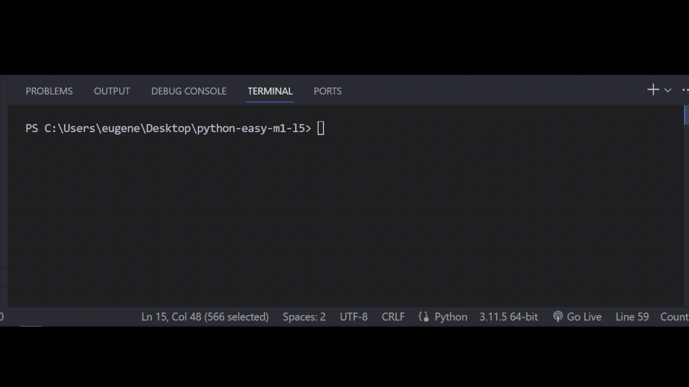

# Задача 1

Исправь ошибки в коде

У Бо совсем недавно сломалась зарядка для телефона, Бо решил заменить ее и купить новую.

Он зашел на сайт где можно было их купить, но он заметил что на сайте сломались фильтры

по поиску товара, поэтому Бо написал свой собственный, которы будет выводить товары

подходящие под мощность которая больше 5 ватт, но меньше 10 ватт.

# Результат

