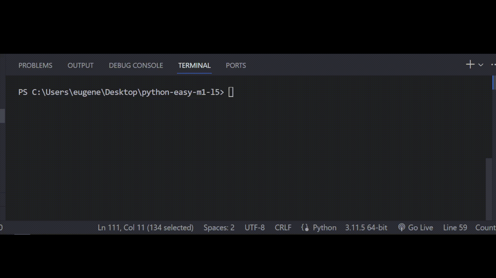

# Задача 10

Исправь ошибки в коде

Бо вместе с коалой взяли лотерейные билеты, Бо заметил что на билете нужно было

найти три монеты или три вишни, однако картинка того что оказалось на билете не

оказалось. Бо написал программу, которая будет сравнивать его билет с возможными

выигрышными вариантами, однако, в программе есть ошибки, помоги Бо их исправить.

# Результат

