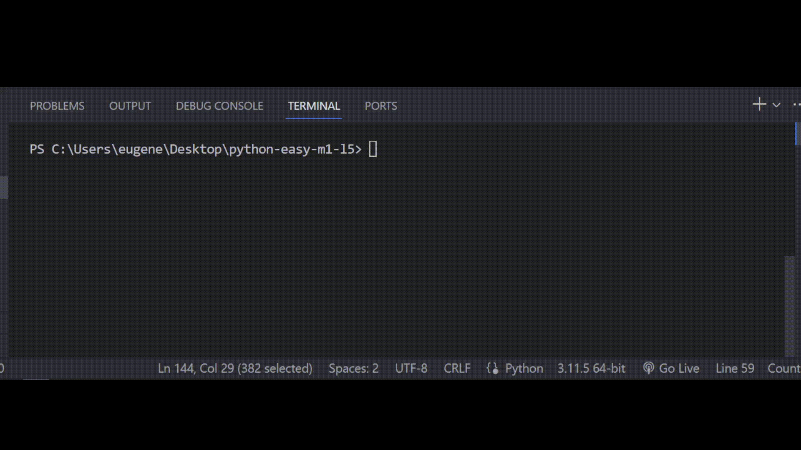

# Задача 12

Исправь ошибки в коде

Бо во время выходных решил посетить другой город, однако он не знает какой способ

выбрать лучше всего, поездом или самолетом. Бо написал программу, которая определяет

что будет дешевле, однако, у Бо в программе есть ошибки.

Исправь ошибки в коде программы так, чтобы результат был как на картинке:

Программа должна узнать что дешевле, и проверить, впишется ли что-то из этого

в бюджет Бо (1100 монет).

# Результат

