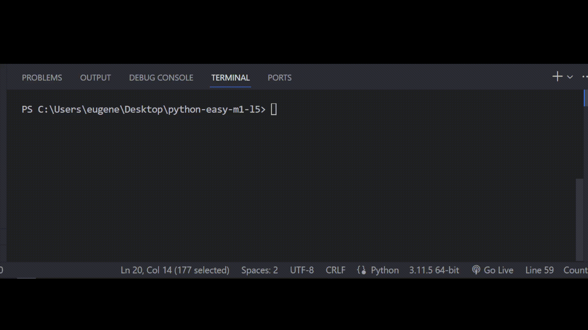

# Задача 2

Исправь ошибки в коде

Недавно Бо нашел у знакомого на полке старый компьютер, Бо спросил знакомого за

этот компьютер, на что он ответил что компьютер давно сломался и ему он без

надобности. Знакомый отдал старый компьютер Бо, запустив этот компьютер, он увидел

синий экран смерти. Бо решил проверить, действительно ли строка на синем экране

смерти не может быть больше 80 символов.

Бо написал для этого программу в которой он обнаружил ошибки, исправь эти ошибки.

# Результат

