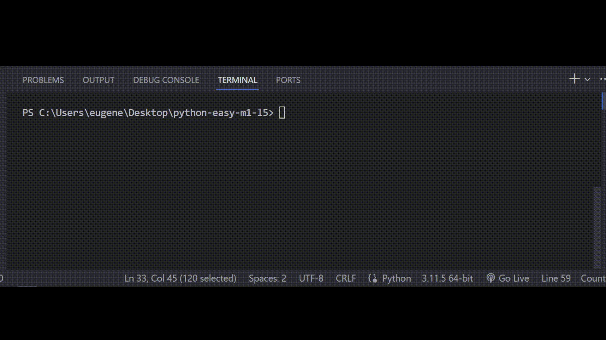

# Задача 3

Исправь ошибки в коде

Когда Бо сидел в тик токе, он заметил новую функцию,

которая в течение 40 дней отсутствия активности на аккаунте,

может скрыть профиль от других пользователей. Активным

считается аккаунт, где суммарное количество лайков больше количества подписчиков в 3 раза.

Бо написал программу, которая покажет ему, активный у него

аккаунт или нет, вот только Бо заметил ошибки в своей программе, помогите Бо исправить ошибки.

# Результат

