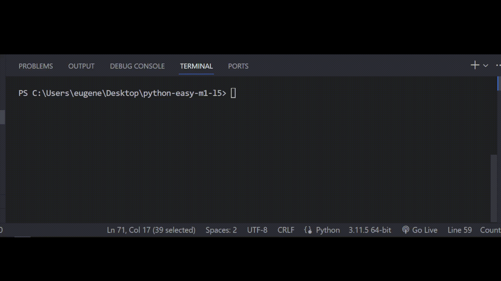

# Задача 7

Факультет радиотехники в академии экспериментировал с разными

сигналами, в результате чего компьютер Бо получил зашифрованное

сообщение, которое имело в себе число <347> и сообщение: "Если вы

получили это сообщение, пожалуйста отправьте нам на почту, какое в

вашем сообщении число, и больше или равно это число двумстам".

Помогите Бо написать программу для этого, которая будет отвечать на такие сигналы автоматически.

# Результат

