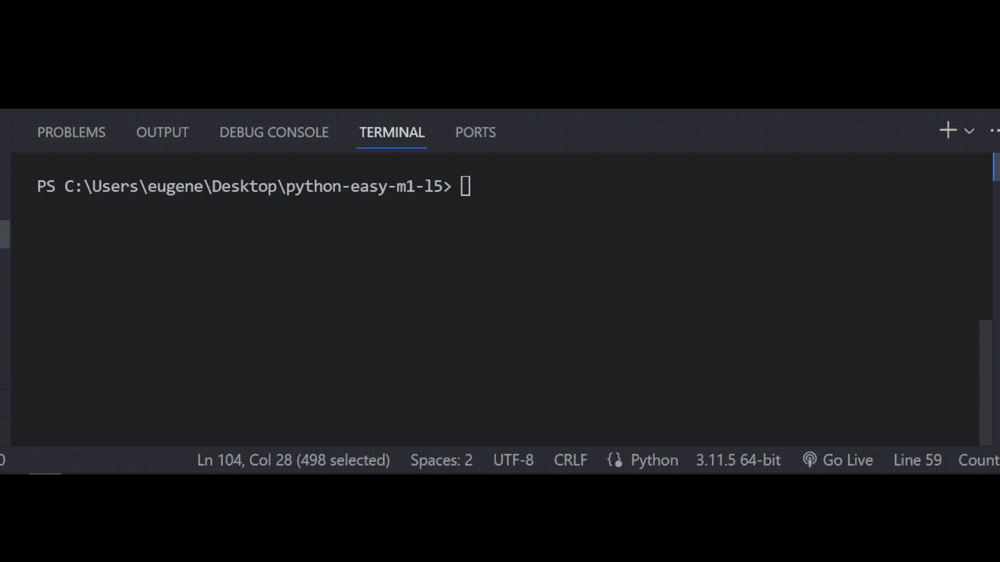

# Задача 9

Реши задачу

Бо нашел на складе академии старую перфокарту, воспользовавшись старым

устройством для их чтения он получил: 001111

Бо заметил что эта перфокарта хранила оценки одного из учеников в академии.

Помогите Бо с помощью программы привести это в читабельный вид. В конце выведите,

было ли количество хороших оценок больше 3‑х и больше количества плохих оценок.

# Результат

