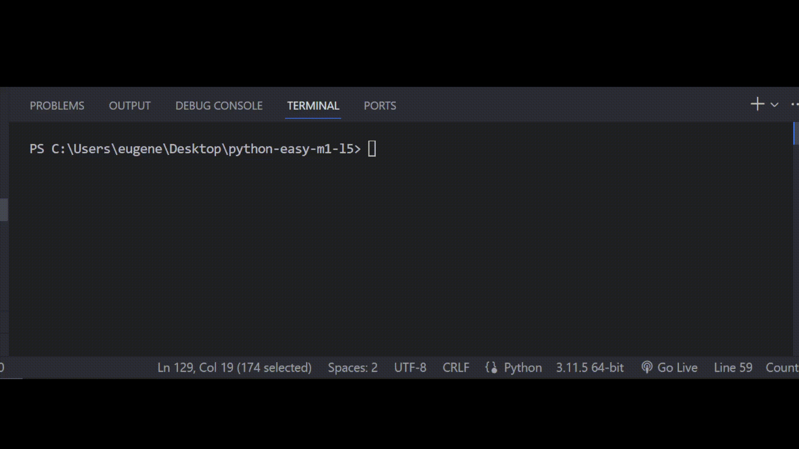

# Залача 11

Исправь ошибки в коде

Бо было неудобно использовать встроенное приложение с заметками, поэтому он решил написать

свое приложение для заметок, что бы осуществить поиск по заметкам Бо решил написать маленькую

программу, которая будет показывать нужную заметку если поисковой запрос имеет либо

приставку "Заметка" вначале, либо "Запись" в конце, иначе он бы показывал на экране

самую первую заметку.

Однако Бо допустил пару ошибок во время написания программы, помоги Бо их исправить.

# Результат

