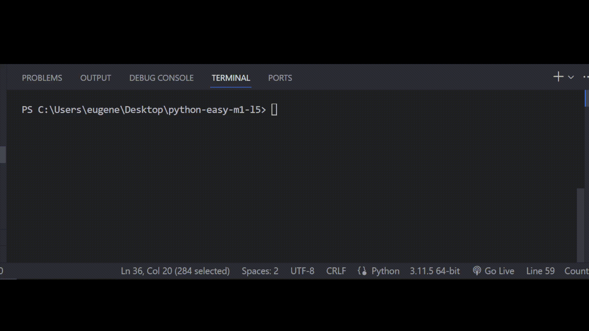

# Залача 3

Исправь ошибки в коде

Бо готовил свой любимый салат, как вдруг заметил что у него не достает некоторых ингредиентов,

Бо решил написать программу, которая будет искать взаимозаменяемые ингредиенты.

Бо закончил писать код, но он заметил что, допустил ошибки при написании. Помоги Бо исправить

ошибки в его программе.

# Результат

