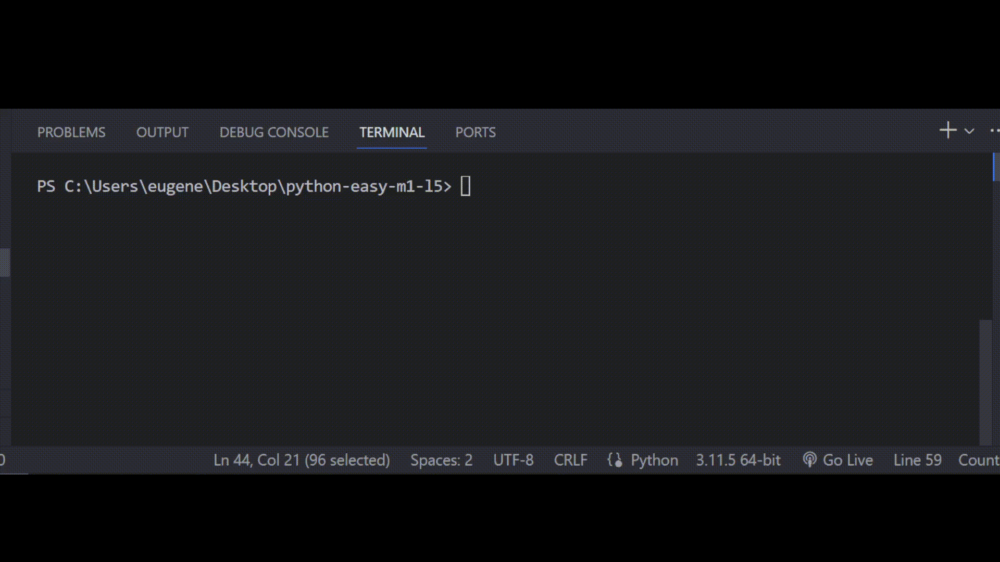

# Залача 4

Исправь ошибки в коде

Бо писал в качестве домашнего задания игру крестики нолики, он решил сделать проверку

на то, занята ли эта клетка. Бо заметил что он, допустил ошибки во время написания

программы, помоги ему исправить его ошибки.

# Результат

