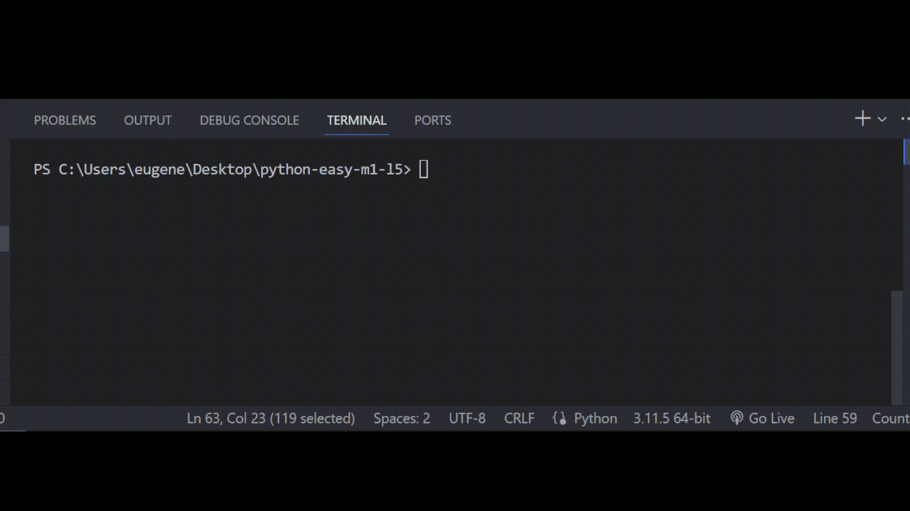

# Залача 6

Реши задачу

Бо заметил что в YouTube появилась новая функция получения монет,

для того чтобы получить одну монету, нужно было либо посмотреть на ютуб

больше 40 видео, или подписаться на 10+ каналов.

Бо стал заинтересован в том как реализовать такую же функцию, помоги Бо

написать проверку действий пользователя.

# Результат

