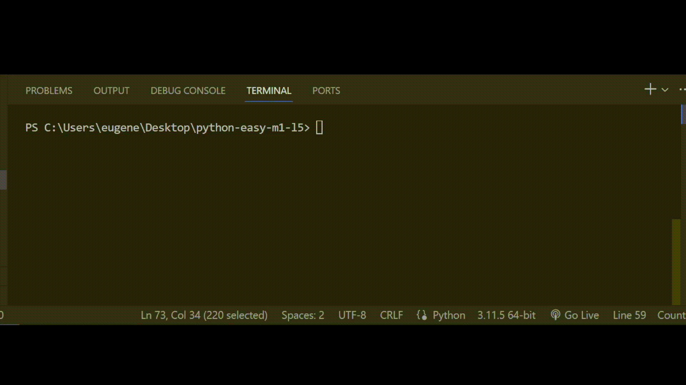

# Залача 7

Реши задачу

Один из учителей академии решил устроить конкурс в своем инстаграм аккаунте, главными условиями были:

- Подписка на инстаграм аккаунт
- Лайк на последнем посте
- Наличие открытого профиля

Бо попросили написать программу, которая будет проверять, выполнили ли пользователи условия.

# Результат

