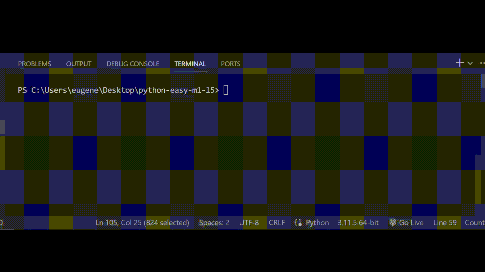

# Залача 8

Реши задачу

Бо вместе с коалой, собирали собственный гриль как проект на досуге, коала занимается самой

сборкой гриля, в то время как Бо писал ПО для него, в этот раз нужно написать регулировку

температуры для разных режимов.

Если режим равен "Баранина" или "Говядина", температура должна выставится на 180 градусов.

Если режим равен "Курица" или "Кролик", температура должна выставится на 160 градусов.

Если режим не подходит к выше перечисленным, температуру нужно поставить на 70 градусов

Тебе нужно написать проверку на каждый режим.

# Результат

