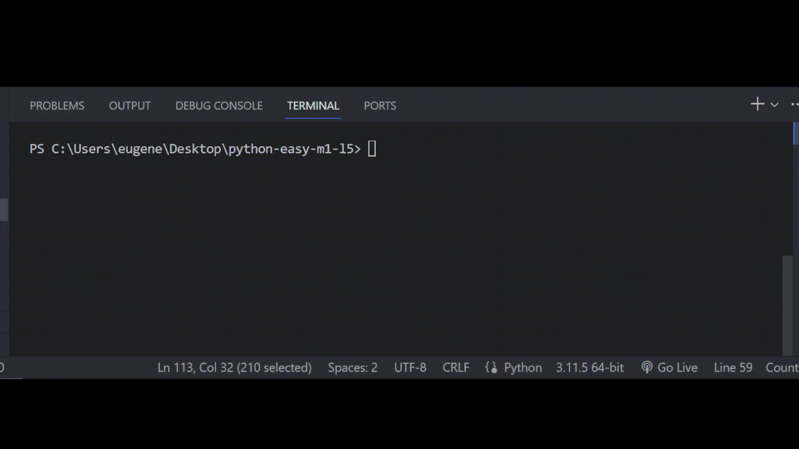

# Залача 9

Дополни код программы

Бо совсем недавно сменил старую полку в своей комнате на новую высокотехнологичную,

теперь Бо нужно настроить ее программный код так, чтобы на ней стояли книги, которые

не начинаются с цифр "1" или "2" или "3".

Иначе, мы оставляем их на старой полке. Бо написал часть кода, однако, ему требуется

помощь, помоги Бо дописать его программу.

# Результат

